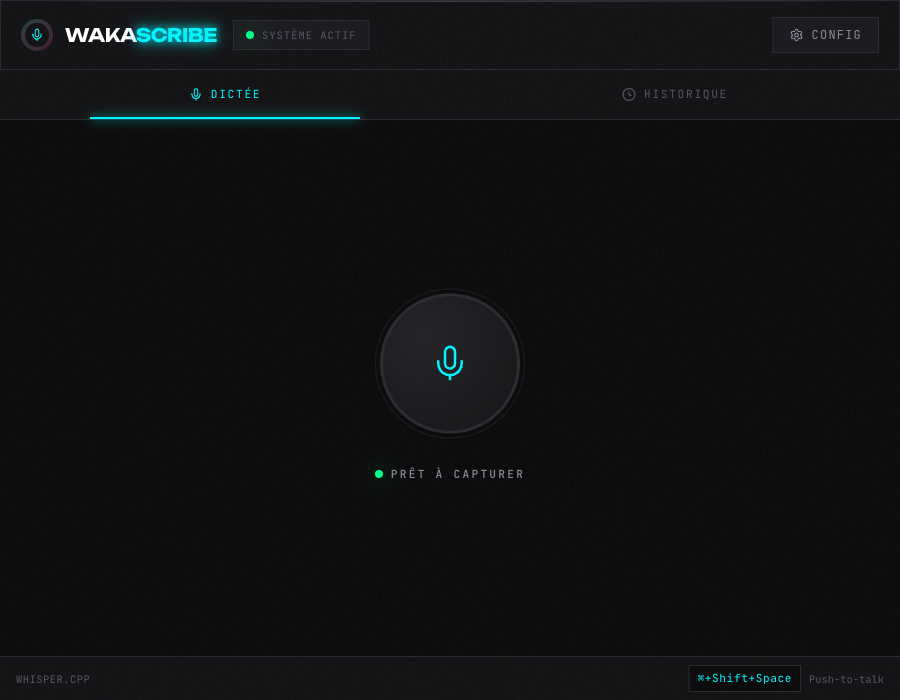
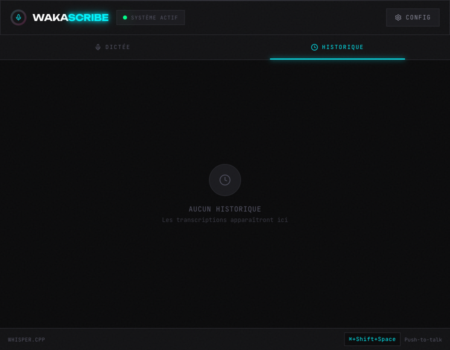
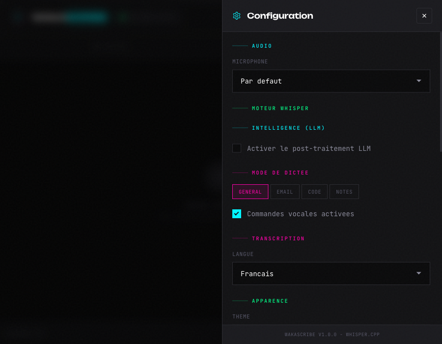
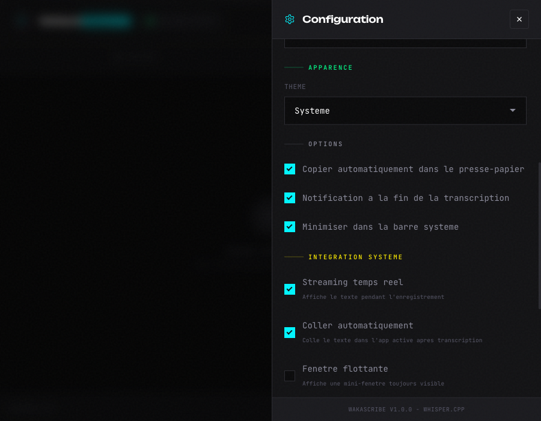
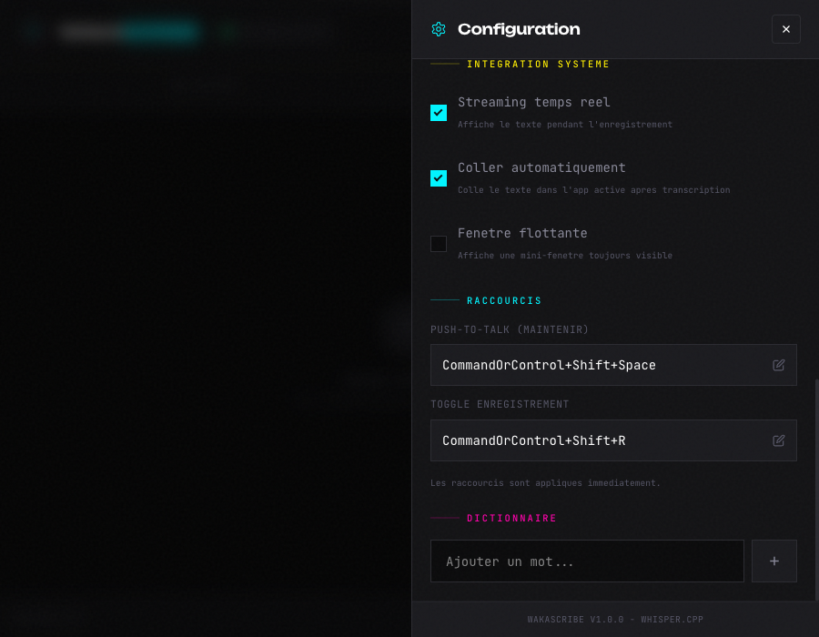

<p align="center">
  
</p>

<h1 align="center">WakaScribe</h1>

<p align="center">
  <strong>🎙️ Dictée vocale intelligente, locale et privée</strong>
</p>

<p align="center">
  <a href="#-fonctionnalités">Fonctionnalités</a> •
  <a href="#-installation">Installation</a> •
  <a href="#-utilisation">Utilisation</a> •
  <a href="#-paramètres">Paramètres</a> •
  <a href="#-raccourcis-clavier">Raccourcis</a> •
  <a href="#-faq">FAQ</a>
</p>

<p align="center">
  
  
  
  
</p>

---

## 🌟 Présentation

**WakaScribe** est une application de dictée vocale nouvelle génération qui transforme votre voix en texte avec une précision remarquable. Contrairement aux solutions cloud, WakaScribe fonctionne **100% en local** sur votre machine, garantissant une confidentialité totale de vos données.

### ✨ Points forts

| | |
|---|---|
| 🔒 **100% Local** | Aucune donnée n'est envoyée sur Internet. Votre vie privée est préservée. |
| ⚡ **Ultra rapide** | Transcription en temps réel grâce à Whisper.cpp optimisé |
| 🌍 **Multilingue** | Support de 99 langues avec détection automatique |
| 🤖 **IA Intégrée** | Amélioration du texte via LLM (optionnel, Groq) |
| 💻 **Cross-platform** | macOS, Windows et Linux |
| 🆓 **Gratuit** | Freeware, usage illimité |

---

## 🚀 Fonctionnalités

### 🎤 Dictée vocale

#### Mode Push-to-Talk (PTT)
Maintenez une touche pour parler, relâchez pour transcrire et coller automatiquement.

```
Maintenir ⌘+Shift+Espace → Parler → Relâcher → Texte collé automatiquement
```

#### Mode Toggle
Cliquez pour démarrer/arrêter l'enregistrement via l'interface.

---

### 📝 Modes de dictée

WakaScribe adapte la transcription selon le contexte :

| Mode | Icône | Description | Optimisation |
|------|-------|-------------|--------------|
| **Général** | 📄 | Texte standard, emails, notes | Ponctuation naturelle |
| **Email** | 📧 | Optimisé pour les courriels | Formules de politesse, structure |
| **Code** | 💻 | Pour les développeurs | Préserve la syntaxe technique |
| **Notes** | 📋 | Prise de notes rapide | Format concis, bullet points |

---

### 🤖 Amélioration par IA (LLM)

Activez l'amélioration par intelligence artificielle pour :

- ✅ Corriger automatiquement la grammaire et l'orthographe
- ✅ Ajouter la ponctuation manquante
- ✅ Reformuler pour plus de clarté
- ✅ Adapter le style au mode de dictée

**Modes LLM disponibles :**

| Mode | Icône | Description |
|------|-------|-------------|
| **Correction** | 🔧 | Corrige les erreurs sans modifier le style |
| **Amélioration** | ✨ | Reformule pour plus de clarté et fluidité |
| **Formatage** | 📐 | Structure le texte (paragraphes, listes) |

> 💡 **Note** : Le LLM utilise l'API Groq (gratuite) et nécessite une connexion Internet.

---

### 🗣️ Commandes vocales

Contrôlez la ponctuation et le formatage avec votre voix :

| Commande vocale | Résultat |
|-----------------|----------|
| "Nouveau paragraphe" | ↵ (saut de ligne) |
| "Nouvelle ligne" | ↵ (saut de ligne) |
| "Point" | . |
| "Virgule" | , |
| "Point d'interrogation" | ? |
| "Point d'exclamation" | ! |
| "Deux points" | : |
| "Point virgule" | ; |
| "Ouvrir les guillemets" | « |
| "Fermer les guillemets" | » |
| "Ouvrir parenthèse" | ( |
| "Fermer parenthèse" | ) |
| "Tiret" | - |

---

### 📜 Historique

Accédez facilement à vos transcriptions passées :

- 📋 **50 dernières transcriptions** conservées
- 🔍 Accès rapide depuis l'onglet Historique
- 📋 **Copie en un clic** dans le presse-papier
- ⏱️ Affichage de la durée et du temps de traitement
- 🗑️ Suppression individuelle ou totale

<p align="center">
  
</p>

---

### 🪟 Fenêtre flottante

Une fenêtre compacte et toujours visible pour :

- 👁️ Voir le statut d'enregistrement en temps réel
- 📝 Afficher la transcription en cours (streaming)
- 🏷️ Voir le mode actif et le statut LLM
- 🖱️ Déplaçable par glisser-déposer
- 📌 Reste au-dessus des autres fenêtres

---

### 🔔 Icône système (Tray)

WakaScribe reste accessible via l'icône dans la barre de menu / barre des tâches :

| État | Icône | Signification |
|------|-------|---------------|
| Prêt | 🟢 | L'application est prête |
| Enregistrement | 🔴 | Capture audio en cours |

**Menu disponible :**
- 🏠 Accueil - Ouvrir la fenêtre principale
- 📋 Coller dernière transcription
- 🎤 Sélection du microphone
- 🌍 Sélection de la langue
- ⌨️ Raccourcis clavier
- ❓ Aide
- 🚪 Quitter

---

## 📥 Installation

### 🍎 macOS

1. **Téléchargez** le fichier `.dmg` correspondant à votre Mac :
   - **Mac Intel** : `WakaScribe_x64.dmg`
   - **Mac M1/M2/M3/M4** : `WakaScribe_arm64.dmg`

2. **Ouvrez** le fichier `.dmg`

3. **Glissez** WakaScribe dans le dossier Applications

4. **Premier lancement** : Clic droit → Ouvrir (contournement Gatekeeper)

5. **⚠️ Important** : Autorisez les permissions :
   ```
   Réglages Système → Confidentialité et sécurité → Microphone → ✅ WakaScribe
   Réglages Système → Confidentialité et sécurité → Accessibilité → ✅ WakaScribe
   ```

### 🪟 Windows

1. **Téléchargez** `WakaScribe_Setup.exe`

2. **Exécutez** l'installateur

3. **Suivez** les instructions à l'écran

4. **Lancez** WakaScribe depuis le menu Démarrer

### 🐧 Linux

1. **Téléchargez** le paquet correspondant :
   - `.deb` pour Ubuntu/Debian
   - `.rpm` pour Fedora/RHEL
   - `.AppImage` pour toutes distributions

2. **Installez** les dépendances pour l'auto-paste :

   **X11 (Ubuntu/Debian):**
   ```bash
   sudo apt install xclip xdotool
   ```

   **Wayland (Ubuntu/Debian):**
   ```bash
   sudo apt install wl-clipboard wtype
   ```

3. **Installez** l'application :
   ```bash
   # Debian/Ubuntu
   sudo dpkg -i wakascribe_*.deb

   # Ou AppImage
   chmod +x WakaScribe_*.AppImage
   ./WakaScribe_*.AppImage
   ```

---

## 🎯 Utilisation

### 🏁 Premier lancement

#### Étape 1 : Télécharger un modèle

Au premier lancement, téléchargez un modèle de reconnaissance vocale :

| Modèle | Taille | Qualité | Vitesse | Recommandé pour |
|--------|--------|---------|---------|-----------------|
| **Tiny** | 75 Mo | ⭐⭐ | ⚡⚡⚡⚡ | Tests rapides |
| **Small** | 466 Mo | ⭐⭐⭐ | ⚡⚡⚡ | ✅ Usage quotidien |
| **Medium** | 1.5 Go | ⭐⭐⭐⭐ | ⚡⚡ | Qualité maximale |

> 💡 **Recommandation** : Commencez avec **Small** pour un bon équilibre.

#### Étape 2 : Configurer le microphone

Si vous avez plusieurs microphones, sélectionnez celui que vous souhaitez utiliser dans les paramètres.

#### Étape 3 : Tester la dictée

Cliquez sur le bouton micro central et parlez !

---

### 📋 Workflow quotidien

```
1. 🎯 Placez votre curseur là où vous voulez écrire (email, document, chat...)
2. 🎤 Maintenez ⌘+Shift+Espace (ou votre raccourci personnalisé)
3. 🗣️ Parlez naturellement
4. ✋ Relâchez la touche
5. ✨ Le texte apparaît automatiquement !
```

### 💡 Conseils pour de meilleurs résultats

- 🎤 **Parlez clairement** mais naturellement
- 🔇 **Évitez le bruit de fond** excessif
- 📏 **Phrases complètes** : la ponctuation est mieux détectée
- 🌍 **Une seule langue** par enregistrement pour de meilleurs résultats

---

## ⚙️ Paramètres

Accédez aux paramètres via le bouton ⚙️ ou `⌘+,`

<p align="center">
  
  
</p>

### 🎤 Audio

| Paramètre | Description | Options |
|-----------|-------------|---------|
| **Microphone** | Périphérique d'entrée audio | Liste des micros disponibles |
| **Streaming** | Affichage temps réel pendant l'enregistrement | Activé / Désactivé |

### 🌍 Langue

| Paramètre | Description | Options |
|-----------|-------------|---------|
| **Langue** | Langue parlée | 99 langues + Auto |
| **Détection auto** | Laisse Whisper détecter | Activé / Désactivé |

**Langues principales supportées :**
🇫🇷 Français • 🇬🇧 English • 🇩🇪 Deutsch • 🇪🇸 Español • 🇮🇹 Italiano • 🇵🇹 Português • 🇳🇱 Nederlands • 🇵🇱 Polski • 🇷🇺 Русский • 🇨🇳 中文 • 🇯🇵 日本語 • 🇰🇷 한국어 • 🇸🇦 العربية

### 📝 Dictée

| Paramètre | Description | Options |
|-----------|-------------|---------|
| **Mode de dictée** | Contexte d'utilisation | Général, Email, Code, Notes |
| **Commandes vocales** | Reconnaissance des commandes | Activé / Désactivé |
| **Copie automatique** | Copier après transcription | Activé / Désactivé |
| **Auto-paste** | Coller automatiquement | Activé / Désactivé |

### 🤖 LLM (Intelligence Artificielle)

| Paramètre | Description | Options |
|-----------|-------------|---------|
| **Activer LLM** | Amélioration par IA | Activé / Désactivé |
| **Mode LLM** | Type de traitement | Correction, Amélioration, Formatage |
| **Clé API Groq** | Authentification | Votre clé API |

#### 🔑 Obtenir une clé API Groq (gratuite)

1. Rendez-vous sur [console.groq.com](https://console.groq.com)
2. Créez un compte gratuit
3. Allez dans **API Keys**
4. Cliquez sur **Create API Key**
5. Copiez la clé et collez-la dans WakaScribe

### ⌨️ Raccourcis

| Paramètre | Description | Défaut |
|-----------|-------------|--------|
| **Push-to-Talk** | Maintenir pour dicter | `⌘+Shift+Espace` |
| **Toggle Record** | Basculer enregistrement | `⌘+Shift+R` |

> 💡 Cliquez sur le champ et appuyez sur votre nouvelle combinaison pour modifier.

### 📦 Modèles Whisper

| Action | Description |
|--------|-------------|
| **📥 Télécharger** | Télécharge un nouveau modèle |
| **🗑️ Supprimer** | Supprime un modèle installé |
| **🔄 Changer** | Bascule vers un autre modèle |

---

## ⌨️ Raccourcis clavier

<p align="center">
  
</p>

### 🌐 Raccourcis globaux

Ces raccourcis fonctionnent même quand WakaScribe n'est pas au premier plan :

| Raccourci macOS | Raccourci Windows/Linux | Action |
|-----------------|------------------------|--------|
| `⌘+Shift+Espace` | `Ctrl+Shift+Espace` | 🎤 Push-to-Talk (maintenir) |
| `⌘+Shift+R` | `Ctrl+Shift+R` | 🔴 Toggle enregistrement |
| `⌥+⌘+V` | `Alt+Ctrl+V` | 📋 Coller dernière transcription |

### 🖥️ Dans l'application

| Raccourci macOS | Raccourci Windows/Linux | Action |
|-----------------|------------------------|--------|
| `⌘+,` | `Ctrl+,` | ⚙️ Ouvrir les paramètres |
| `⌘+1` | `Ctrl+1` | 🎤 Onglet Dictée |
| `⌘+2` | `Ctrl+2` | 📜 Onglet Historique |
| `⌘+Q` | `Alt+F4` | 🚪 Quitter |

---

## 🔧 Dépannage

### 🎤 Le microphone n'est pas détecté

<details>
<summary>Cliquez pour voir la solution</summary>

1. Vérifiez que le microphone est correctement branché
2. **macOS** : Réglages Système → Confidentialité → Microphone → ✅ WakaScribe
3. **Windows** : Paramètres → Confidentialité → Microphone → Autoriser les applications
4. Redémarrez WakaScribe
</details>

### 📋 L'auto-paste ne fonctionne pas

<details>
<summary>Cliquez pour voir la solution</summary>

**macOS :**
```
Réglages Système → Confidentialité et sécurité → Accessibilité
→ Activez WakaScribe
```

**Windows :**
- Exécutez WakaScribe en tant qu'administrateur (pour certaines applications)

**Linux :**
```bash
# X11
sudo apt install xdotool xclip

# Wayland
sudo apt install wtype wl-clipboard
```
</details>

### 🐢 La transcription est lente

<details>
<summary>Cliquez pour voir la solution</summary>

1. Utilisez un modèle plus léger (Tiny ou Small)
2. Fermez les applications gourmandes en ressources
3. **macOS** : Vérifiez que vous utilisez la version native (Intel ou ARM selon votre Mac)
4. Redémarrez l'application
</details>

### 🤖 Le LLM ne fonctionne pas

<details>
<summary>Cliquez pour voir la solution</summary>

1. Vérifiez votre connexion Internet
2. Dans Paramètres → LLM :
   - Vérifiez que "Activer LLM" est coché
   - Cliquez sur "Valider" pour tester votre clé API
3. Si la clé est invalide, générez-en une nouvelle sur [console.groq.com](https://console.groq.com)
</details>

### 🔇 Pas de son capturé

<details>
<summary>Cliquez pour voir la solution</summary>

1. Testez votre microphone dans une autre application
2. Dans les paramètres, sélectionnez explicitement votre microphone
3. Augmentez le volume d'entrée du microphone dans les paramètres système
</details>

---

## ❓ FAQ

<details>
<summary><strong>💰 WakaScribe est-il vraiment gratuit ?</strong></summary>

Oui ! WakaScribe est un freeware 100% gratuit. Pas d'abonnement, pas de limite d'utilisation, pas de publicité.
</details>

<details>
<summary><strong>🔒 Mes données vocales sont-elles envoyées sur Internet ?</strong></summary>

**Non.** La transcription Whisper est effectuée **100% en local** sur votre machine. Vos enregistrements audio ne quittent jamais votre ordinateur.

**Exception** : Si vous activez le LLM, le **texte transcrit** (pas l'audio) est envoyé à l'API Groq pour amélioration. Cette fonctionnalité est optionnelle.
</details>

<details>
<summary><strong>📊 Quelle est la différence entre les modèles Tiny, Small et Medium ?</strong></summary>

| Modèle | Précision | Vitesse | RAM | Recommandation |
|--------|-----------|---------|-----|----------------|
| Tiny | ⭐⭐ | ⚡⚡⚡⚡ | ~1 Go | Tests |
| Small | ⭐⭐⭐ | ⚡⚡⚡ | ~2 Go | ✅ Quotidien |
| Medium | ⭐⭐⭐⭐ | ⚡⚡ | ~4 Go | Pro |
</details>

<details>
<summary><strong>✈️ Puis-je utiliser WakaScribe hors ligne ?</strong></summary>

**Oui !** Toutes les fonctionnalités principales (transcription, commandes vocales, historique) fonctionnent **sans connexion Internet**.

Seule l'amélioration LLM nécessite une connexion.
</details>

<details>
<summary><strong>🌍 Quelles langues sont supportées ?</strong></summary>

WakaScribe supporte **99 langues** grâce à Whisper, dont :

- 🇫🇷 Français
- 🇬🇧 Anglais
- 🇩🇪 Allemand
- 🇪🇸 Espagnol
- 🇮🇹 Italien
- 🇵🇹 Portugais
- 🇳🇱 Néerlandais
- 🇵🇱 Polonais
- 🇷🇺 Russe
- 🇨🇳 Chinois (simplifié et traditionnel)
- 🇯🇵 Japonais
- 🇰🇷 Coréen
- 🇸🇦 Arabe
- 🇮🇳 Hindi
- Et bien d'autres...
</details>

<details>
<summary><strong>🔑 Comment obtenir une clé API Groq gratuite ?</strong></summary>

1. Allez sur [console.groq.com](https://console.groq.com)
2. Créez un compte gratuit (email ou Google)
3. Dans le menu, allez dans **API Keys**
4. Cliquez sur **Create API Key**
5. Donnez un nom (ex: "WakaScribe")
6. Copiez la clé générée
7. Collez-la dans WakaScribe → Paramètres → LLM
</details>

<details>
<summary><strong>🖥️ WakaScribe fonctionne-t-il sur mon Mac M1/M2/M3/M4 ?</strong></summary>

**Oui !** WakaScribe est compilé nativement pour Apple Silicon. Téléchargez la version `arm64` pour des performances optimales.
</details>

---

## 📊 Performances

### Vitesse de transcription

| Configuration | Modèle Small | Modèle Medium |
|--------------|--------------|---------------|
| Mac M1/M2/M3/M4 | ~12x temps réel | ~8x temps réel |
| Mac Intel i7+ | ~6x temps réel | ~4x temps réel |
| Windows (CPU moderne) | ~5x temps réel | ~3x temps réel |
| Linux (CPU moderne) | ~5x temps réel | ~3x temps réel |

> 📝 **Exemple** : Un audio de 10 secondes est transcrit en moins d'1 seconde sur Mac M2.

### Latence bout-en-bout

| Étape | Durée typique |
|-------|---------------|
| Capture audio | Temps réel |
| Transcription (Small) | < 1 sec |
| LLM (si activé) | 0.5-2 sec |
| Auto-paste | < 100 ms |
| **Total** | **< 3 sec** |

---

## 🔒 Confidentialité & Sécurité

WakaScribe a été conçu avec la vie privée comme priorité absolue :

| Aspect | Garantie |
|--------|----------|
| 🎤 **Audio** | Traité 100% localement, jamais envoyé |
| 📊 **Télémétrie** | Aucune collecte de données |
| 💾 **Historique** | Stocké uniquement sur votre machine |
| 🔑 **Clés API** | Stockées dans le trousseau sécurisé du système |
| 🤖 **LLM** | Optionnel - seul le texte est envoyé (pas l'audio) |

---

## 🆘 Support & Communauté

| Canal | Lien |
|-------|------|
| 📧 Email | support@wakascribe.com |
| 🐛 Signaler un bug | [GitHub Issues](https://github.com/wakastellar/wakascribe/issues) |
| 💬 Discord | [Rejoindre](https://discord.gg/wakascribe) |
| 🐦 Twitter | [@WakaScribe](https://twitter.com/wakascribe) |

---

## 📄 Licence

WakaScribe est un **freeware** distribué gratuitement.

- ✅ Usage personnel et professionnel autorisé
- ✅ Distribution gratuite autorisée
- ❌ Revente interdite
- ❌ Modification du code source interdite

---

<p align="center">
  
</p>

<p align="center">
  Fait avec ❤️ par <a href="https://wakastellar.com"><strong>WakaStellar</strong></a>
</p>

<p align="center">
  <sub>© 2024-2026 WakaStellar. Tous droits réservés.</sub>
</p>
